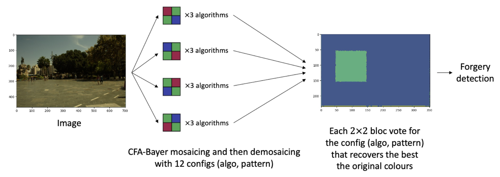

# Towards a reliable detection of forgeries based on demosaicing

**Author:** Jérémie Dentan

<p align="center">
  
</p>

This repository is the implementation of a review of the paper "Demosaicing to Detect Demosaicing and Image Forgeries" written by Quentin Bammey, Rafael Grompone von Gioi, and Jean-Michel Morel, which proposes a demosaicing-based forgery detection method.

The report by the author: [http://dx.doi.org/10.13140/RG.2.2.17584.02568](http://dx.doi.org/10.13140/RG.2.2.17584.02568)
The original paper, by Quentin Bammey, Rafael Grompone von Gioi, Jean-Michel Morel: [https://doi.org/10.1109/WIFS55849.2022.9975454](https://doi.org/10.1109/WIFS55849.2022.9975454)

## Overview

For an easy demonstration of the experiments made by the author for this review, we invite you to check out the two following repositories:

-  For experiment 1, about the detection of demosaicing configuration: [doc/configuration_detection_demonstration.ipynb](https://github.com/DentanJeremie/demosaicing-detection/blob/main/doc/configuration_detection_demonstration.ipynb)
-  For experiment 2, about the detection of the image forgeries: [doc/forgery_detection_demonstration.ipynb](https://github.com/DentanJeremie/demosaicing-detection/blob/main/doc/forgery_detection_demonstration.ipynb)

## Run the full experiments

This section explains how to run the full experiments that were run by the author for the reiew.

### Set up

The code of is expected to run in **Python 3.9** with the dependencies of `requirements.txt` installed and your PYTHONPATH set to the root of the repository. To do so, execute the following line from the root (i.e. from the folder containing this README file).

```bash
pip install -r requirements.txt
export PYTHONPATH=$(pwd)
```

Moreover, if you want to execute locally the notebooks in the `\doc` folder, you should have `ipykernel` installed, which is not declared in `requirements.txt` for technical reasons linked to the possibility to execute the notebooks on Google Colab. Thus, you should run the following before running the notebooks:

```bash
pip install notebook==6.5.3
```

### Execution

After having set up your environment, you may run the following lines to reproduce the experiments:

```bash
python src/experiments/evaluate_config_detection.py
python src/experiments/evaluate_forgery_detection.py
```

This will produce some results in the `output` directory, as well as logs in the `logs` directory.

## License and Disclaimer

You may use this software under the Apache 2.0 License. See LICENSE.
